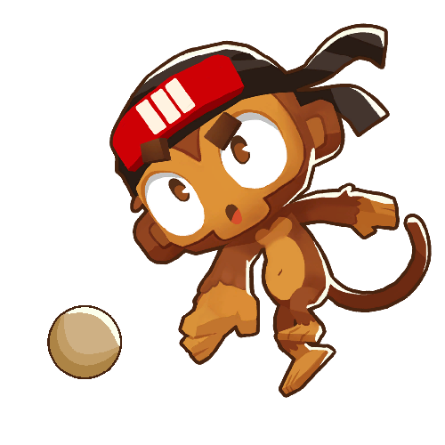

<h1 align="center">Soy Boy Mod</h1>

This is my first ever mod for Bloons TD 6 (so bare with me) and it's meant as a test mod for me to make sure I could get everything working before I make more in depth mods. This mod adds in a new tower: Soy Boy who is a very unassuming character until he reaches his full potential. He currently only has one upgrade path (not like he really needs more than one), but I might return to this tower at a later date to add the other two upgrade paths for more Soy Boy action. I have more mod ideas planned so this will be the first of many crazy mods to come.

